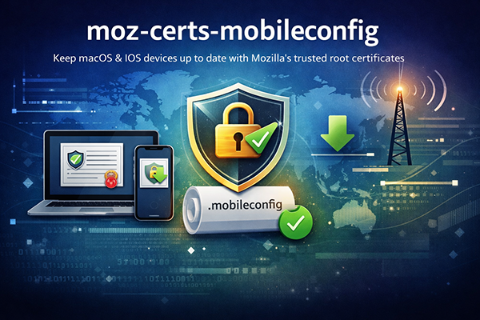

# moz-certs-mobileconfig

<p align="center">
  
</p>

Keeps macOS and iOS devices up to date with Mozilla's trusted root certificates —
useful for systems that no longer receive Apple's own certificate updates.

The generator downloads Mozilla's CA bundle from [curl.se/ca/](https://curl.se/ca/),
builds a signed or unsigned `.mobileconfig` profile, and skips regeneration if
the bundle hasn't changed (SHA-256 check against the existing profile).

A pre-built unsigned profile is published automatically every week via GitHub Actions
and can be installed directly from [jtauschl.github.io/moz-certs-mobileconfig](https://jtauschl.github.io/moz-certs-mobileconfig/).

## Usage

```bash
./generate.sh              # unsigned – no certificate required
./generate.sh -s|--signed  # sign with Apple Developer cert from Keychain
./generate.sh -f|--force   # skip SHA change check, always regenerate
```

Flags can be combined: `./generate.sh --signed --force`

The output is written to `dist/moz-certs.mobileconfig`. When signing, the
certificate is auto-detected from the Keychain and the script accepts either
an `Apple Development` or `Developer ID Application` identity. Set
`SIGNING_IDENTITY` in `generate.sh` to pin a specific certificate. Unsigned
profiles install with a "Not Verified" warning but are otherwise functional.

## Installation on macOS

Open `dist/moz-certs.mobileconfig`. macOS will prompt to install the profile
under System Settings → Privacy & Security → Profiles.

## Installation on iOS

Transfer or host `dist/moz-certs.mobileconfig` so it opens in Safari on iOS.
The profile can then be installed under Settings → General → VPN & Device
Management.

## Requirements

- `curl`, `openssl`, `python3`, `perl` (`shasum`), Internet access to curl.se
- macOS — required for `--signed` (`security` and Keychain access are Apple-only)
- Apple signing certificate in Keychain — only required for `--signed`

Unsigned profile generation works on Linux as well.

## Configuration

The signing certificate is detected automatically from the Keychain.
To pin a specific certificate, set `SIGNING_IDENTITY` at the top of `generate.sh`.

## License

Scripts: [MIT](LICENSE)

Certificate data: sourced from [Mozilla NSS](https://wiki.mozilla.org/CA) via
[curl.se/ca/](https://curl.se/ca/), licensed under
[MPL 2.0](https://www.mozilla.org/en-US/MPL/2.0/).
